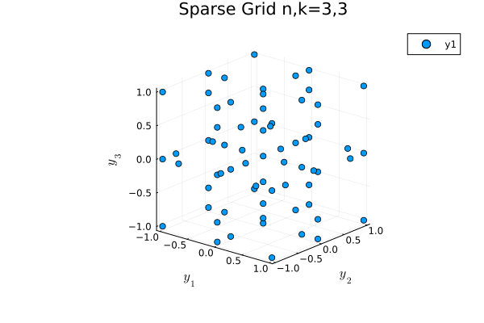

# SparseGridsKit.jl
[](http://benmkent.github.io/SparseGridsKit.jl/)
[](https://github.com/benmkent/SparseGridsKit.jl/actions/workflows/test.yaml)
[](https://codecov.io/github/benmkent/SparseGridsKit.jl)
[](https://github.com/JuliaTesting/Aqua.jl)
[](https://doi.org/10.21105/joss.08300)

A simple implementation of sparse grid polynomial interpolation and corresponding interpolation.

To add the package use the following command:
```
] add SparseGridsKit
```
The construction is based upon the sparse operators introduced by Smolyak (Smolyak, 1963).
Key papers defining the approximation formulation include (Barthelmann,  2000), (Gerstner, 1998) and (Gerstner, 2003).
This construction of the approximation is inspired by the [Sparse Grids MATLAB Kit](https://sites.google.com/view/sparse-grids-kit) (Piazzola, 2024).

This documentation is example driven, with full documentation for each subset of functions given at the end of the relevant example.
This is not a thorough mathematical description of sparse grid approximation, but a practical guide to using the software.

The package is still under development and by no means complete.

## Statement of Need
This Julia implementation closely follows the mathematical description in the adaptive sparse grid approximation literature.
This package aims to aid fast algorithm development and analysis, with an emphasis on applications in uncertainty quantification.

## Contribution Guidelines
To report bugs, seek support or submit request features, please use the [GitHub issue tracker](https://github.com/benmkent/SparseGridsKit.jl/issues).
Please feel free to contribute and submit pull requests.

# Example
In the simplest case one often wants to create a sparse grid using a sequence of nested sets Clenshaw--Curtis points and a Smolyak type multi-index set.
To this end, one uses `create_sparsegrid` with the desired Smolyak multi-index set.
In this case we choose a grid with dimension `n=3` and Smolyak level `w=3`.
```julia
using SparseGridsKit, Plots, LaTeXStrings
# Test create_sparsegrid
n,k =3,3
knots = [GaussHermitePoints(), CCPoints(), UniformPoints()]
rules = [Linear(), Doubling(), Doubling()]
mi_set = create_smolyak_miset(n,k)
sg = create_sparsegrid(mi_set, knots=knots, rule=rules)
nsteps = 100
@gif for i in range(0, stop = 2π, length = nsteps)
        plot(sg)
        plot!(
                title="Sparse Grid n,k="*string(n)*","*string(k),
                xlabel=L"y_1",
                ylabel=L"y_2",
                zlabel=L"y_3",
                camera = (20 * (1 + cos(i)),10 * (1 + cos(i)))
                )
end
```


# Bibliography
  - Smolyak, S. (1963). Quadrature and interpolation formulae on tensor products of certain function classes. Soviet Math. Dokl., 4(5), 240–243.
  - Volker Barthelmann, Erich Novak, & Klaus Ritter (2000). High dimensional polynomial interpolation on sparse grids. Advances in Computational Mathematics, 12(4), 273–288.
  - Gerstner, T., & Griebel, M. (1998). Numerical integration using sparse grids. Numerical algorithms, 18(3), 209–232.
  - Gerstner, T., & Griebel, M. (2003). Dimension–Adaptive Tensor–Product Quadrature. Computing, 71(1), 65–87.
  - Piazzola, C., & Tamellini, L. (2024). Algorithm 1040: The Sparse Grids MATLAB Kit - a MATLAB implementation of sparse grids for high-dimensional function approximation and uncertainty quantification. ACM Transactions on Mathematical Software, 50(1), 1–22.