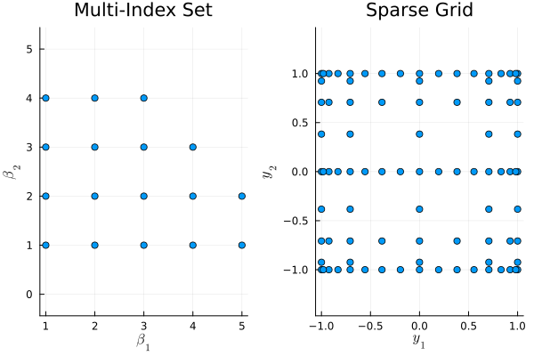
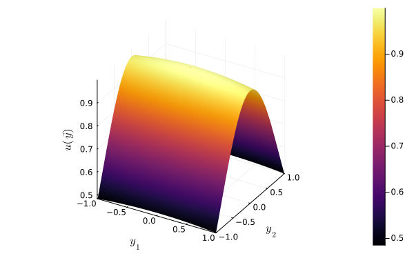

# Summary
Approximating functions with high-dimensional domains is crucial in modern scientific and engineering problems.
An example of this is constructing surrogate models for quantities of interest in high-dimensional, parameterized PDE problems.
These surrogate models are constructed to provide computationally inexpensive yet accurate approximations that can be used in applications such as uncertainty quantification, optimization, and parameter estimation [@UQHandbook2017].
For suitably smooth functions, accurate surrogates can be constructed using global polynomial approximation techniques over the parameter domain, and a common approach is the use of sparse grid polynomial approximation.
In particular, sparse grid polynomial interpolation techniques enable practitioners to approximate solutions to parametric problems in a non-intrusive manner using existing numerical solvers.

`SparseGridsKit.jl` provides a Julia [@julia] toolbox to manually and adaptively construct sparse grid polynomial approximations.
Interpolation and quadrature routines allow evaluation and integration of the surrogate models.
Multi-fidelity approximation via the multi-index stochastic collocation algorithm is also possible [@HajiAli2016; @Jakeman2019; @Piazzola2022].
Approximations can be represented either in a basis of global Lagrange interpolation polynomials or in a basis of domain appropriate spectral-type global polynomials (e.g.\ Legendre, Chebyshev, Hermite, etc.).

# Statement of need
Sparse grid approximation is a well-developed methodology and is featured in many survey articles and textbook chapters [@Bungartz2004; @LeMaitre2010; @Schwab2011; @Cohen2015; @Sullivan2015].
The need for sparse grid surrogate modelling is demonstrated by its use in many applications, from simpler elliptic and parabolic PDEs to complex practical engineering problems [@Piazzola2021; @Piazzola2022; @Li2024].
The `SparseGridsKit.jl` implementation offers a rich set of features to enable this.

Specifically, `SparseGridsKit.jl` is a Julia implementation of adaptive sparse grid global polynomial approximation methods.
Development was motivated by the desire for approximation code that closely resembles the mathematical literature to aid algorithm development and analysis.

The functionality includes:

- One-dimensional knots and quadrature rules.
- Multi-index set construction and manipulation.
- Combination technique sparse grid approximations, and functionality for interpolation, integration and derivatives of the surrogate model.
- Adaptive sparse grid approximation construction based on the ubiquitous Gerstner-Griebel dimensional adaptive algorithm [@Gerstner2003].
This implementation uses profit indicators as described in @Nobile2016.
- Adaptive multi-fidelity approximation via the Multi-Index Stochastic Collocation (MISC) algorithm [@HajiAli2016; @Jakeman2019; @Piazzola2022].
- Conversion to and from Polynomial Chaos / spectral polynomial series representation.
- Limited support for surrogate model differentiation via automatic differentiation.

The functionality described above is tested and documented with examples included in the repository.

Other sparse grid approximation packages in Julia include:

 - [`DistributedSparseGrids.jl`](https://github.com/baxmittens/DistributedSparseGrids.jl) [@Bittens2023]: A Julia package providing adaptive sparse grid approximation using a local hierarchical basis and distributed computing functionality.
 - [`Tasmanian.jl`](https://github.com/floswald/Tasmanian.jl): A Julia interface to the C++ [Tasmanian library](https://github.com/ORNL/Tasmanian).
 - [`AdaptiveSparseGrids.jl`](https://github.com/jacobadenbaum/AdaptiveSparseGrids.jl): A Julia package offering sparse grid approximation using a local hierarchical basis.

 As described above, `SparseGridsKit.jl` instead offers functionality based upon global polynomial approximation targeting problems in which the function is assumed to be suitably smooth.
 The adaptive approximation algorithm is also split cleanly into `SOLVE-ESTIMATE-MARK-REFINE` steps to aid adaptive algorithm development.
 For non-smooth functions, global polynomial approximation is a poor choice and `DistributedSparseGrids.jl` or `AdaptiveSparseGrids.jl` may offer a better approximation strategy.

Other popular software packages implementing sparse grid approximation include:

- `Sparse Grids MATLAB Kit`: A MATLAB package on which the `SparseGridsKit.jl` is loosely based [@Piazzola2024].
- `spinterp`: A MATLAB toolbox for sparse grid interpolation [@spinterp] (no longer maintained).
- `UQLab`: A broad MATLAB uncertainty quantification toolkit [@Marelli2014].
- `PyApprox`: A Python package for high-dimensional approximation [@PyApprox].
- `Dakota`: A C++ library for optimisation and surrogate modelling [@Dakota].
- `UQTk`: A collection of C++/Python uncertainty quantification tools including sparse grid quadrature [@DebusschereUQTk:2017].
- `Tasmanian`,`SG++`: C++ sparse grid approximation implementations with wrappers for many popular software languages [@stoyanov2015tasmanian; @pflueger10spatially].

`SparseGridsKit.jl` specifically offers a Julia toolkit sharing the ethos of the `Sparse Grids MATLAB Kit`: to be user-friendly and aid fast algorithm prototyping.
Notably, `SparseGridsKit.jl` also provides an implementation of the multi-index stochastic collocation algorithm which is currently only available in `PyApprox`.

# Example Adaptive Sparse Grid Approximation
To briefly demonstrate the package, consider the *Gaussian Peak* test function from the Genz test suite [@genz],
$$f:[-1,1]^2\to \mathbb{R}, \quad f(\vec{y}) = \exp\left(-\sum_{i=1}^2 (c_i^2  (y_i - W)^2)\right).$$
The problem is set up as follows:
```julia
using SparseGridsKit, Plots, LaTeXStrings
n = 2
C = 1.0
W = 0.0
T = "quarticdecay"
N = "gaussianpeak"
f = genz(n, C, W, T, N)
```
where `"quarticdecay"` defines coefficients $c_i = C (i + 1)^{-4}$ and the constructed `f` is a function.
An adaptive approximation is constructed as follows using the default configuration and a user specified profit tolerance `proftol`.
```julia
(sg, f_on_Z) = adaptive_sparsegrid(f, n; proftol=1e-10)
```
The adaptively constructed multi-index set and sparse grid are shown in \autoref{miset}.
These reflect the anisotropic nature of the function $f$ due to the decaying coefficients $c_i$.
```julia
miset = get_mi_set(sg)
x     = getindex.(get_mi(miset), 1)
y     = getindex.(get_mi(miset), 2)
plot(
  scatter(x,y, xlabel=L"\beta_1", ylabel=L"\beta_2", legend=:none,
            title="Multi-Index Set", aspect_ratio=:equal),
  plot(sg; legend=:none, xlabel=L"y_1", ylabel=L"y_2", aspect_ratio=:equal)
)
```

{width=1200px}

The resulting adaptive approximation is shown below in \autoref{u}.
```julia
plot(SparseGridApproximation(sg,f_on_Z); seriestype=:surface,
      title="", xlabel=L"y_1", ylabel=L"y_2", zlabel=L"u(\vec{y})")
```

{width=1200px}

Interpolation and integration of the resulting approximation is straightforward.
```julia
f_0       = interpolate_on_sparsegrid(sg, f_on_Z, [[0,0]])
integral  = integrate_on_sparsegrid(sg,f_on_Z)
println("f([0,0]) = $f_0, Integral(f) = $integral")
```
```
f([0,0]) = [1.0], Integral(f) = 0.8343194685053069
```
The sparse grid and the evaluations can then be wrapped up as a `SparseGridApproximation` or a `SpectralSparseGrid`.
These can both be evaluated as functions.
```julia
f_sga         = SparseGridApproximation(sg,f_on_Z)
f_spectral    = convert_to_spectral_approximation(sg, f_on_Z)
f_sga_0       = f_sga([0,0])
f_spectral_0  = f_spectral([0,0])
println("f_sga([0,0]) = $f_sga_0, f_spectral(f) = $f_spectral_0")
```
```
f_sga([0,0])  = 1.0, f_spectral(f) = 1.0
```
For further examples please consult the package documentation.

# Acknowledgements
The author has been supported by the project 202222PACR “Numerical approximation of uncertainty quantification problems for PDEs by multi-fidelity methods (UQ-FLY)", funded by European Union -- NextGenerationEU.

# References
